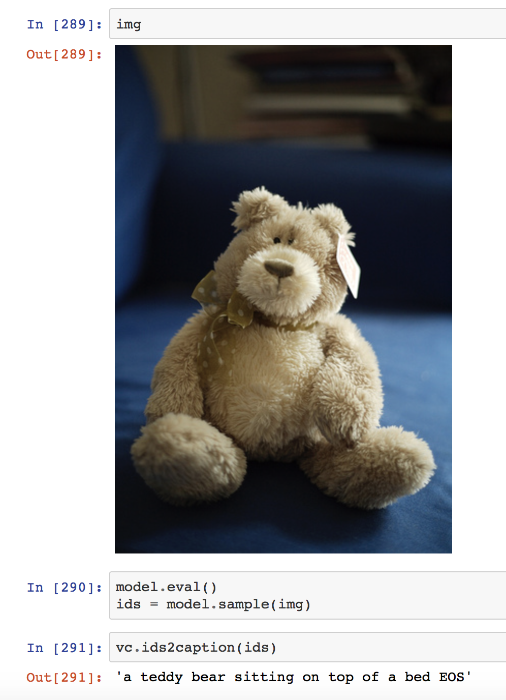

# Image-Caption in Pytorch

Generate captions for an image using PyTorch

## Setup
- Download the dataset
	- [2014 Training images](http://msvocds.blob.core.windows.net/coco2014/train2014.zip)
	- [2014 Train/Val image captions](http://msvocds.blob.core.windows.net/annotations-1-0-3/captions_train-val2014.zip)
- Use pretrained model
	- [caption_model.pkl](https://drive.google.com/file/d/0Bw_Rruvn6N3nVk9pbFZvNjVpSjQ/view?usp=sharing)	

## References

- [eladhoffer/captionGen](https://github.com/eladhoffer/captionGen)
- [yunjey/pytorch-tutorial](https://github.com/yunjey/pytorch-tutorial/tree/master/tutorials/09%20-%20Image%20Captioning)